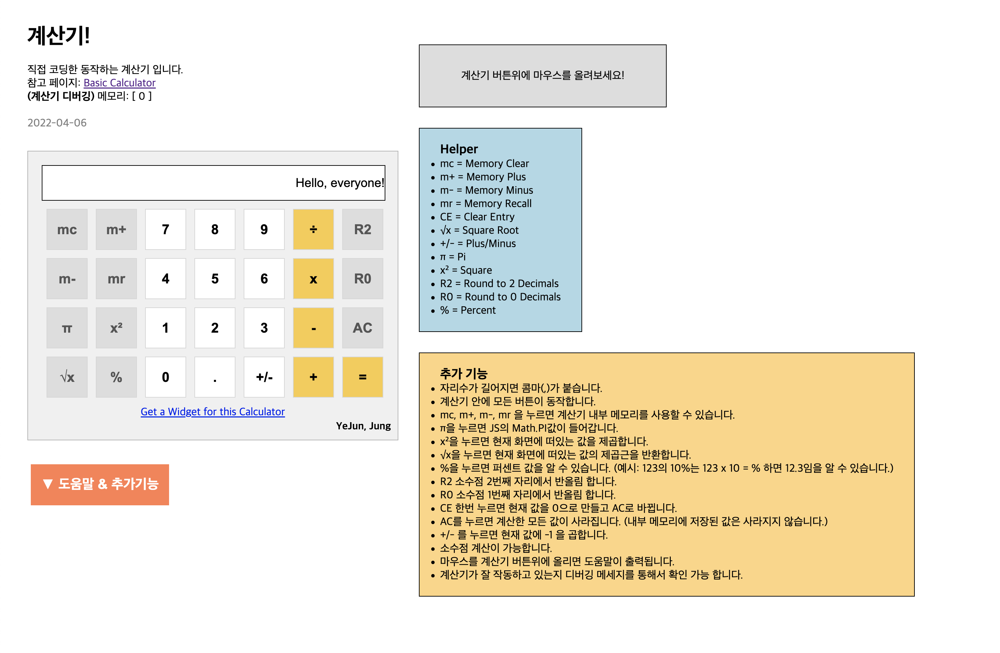

# 웹 계산기

> 웹 프로그래밍 과목을 수강하는 중인데 교수님께서 JS로 만든어진 계산기를 보여주면서
> 똑같이 만들어보자고 하셨습니다. 그래서 최대한 똑같이 만들려고 했고, 계산기 코드는
> 나름대로 고민하면서 만들었습니다.  
> 과제로 만든거지만 계산기 자체는 잘 작동하는 것 같아서 정말 계산 목적으로 사용하셔도
> 무방합니다. (유용한 기능들도 많이 있음으로 잘 활용해주세요)

## 참고한 사이트
- [CalculatorSoup - Basic Caculator](https://www.calculatorsoup.com/calculators/math/basic.php)

## 계산기 UI
- CSS의 Media Query를 이용한 반응형 웹이 적용되었습니다.
- 모바일과 데스크톱 화면을 지원합니다.

## 기능
- 자리수가 길어지면 콤마(,)가 붙습니다.
- 계산기 안에 모든 버튼이 동작합니다.
- mc, m+, m-, mr 을 누르면 계산기 내부 메모리를 사용할 수 있습니다.
- π을 누르면 JS의 Math.PI값이 들어갑니다.
- x²을 누르면 현재 화면에 떠있는 값을 제곱합니다.
- √x을 누르면 현재 화면에 떠있는 값의 제곱근을 반환합니다.
- %을 누르면 퍼센트 값을 알 수 있습니다. (예시: 123의 10%는 123 x 10 = % 하면 12.3임을 알 수 있습니다.)
- R2 소수점 2번째 자리에서 반올림 합니다.
- R0 소수점 1번째 자리에서 반올림 합니다.
- CE 한번 누르면 현재 값을 0으로 만들고 AC로 바뀝니다.
- AC를 누르면 계산한 모든 값이 사라집니다. (내부 메모리에 저장된 값은 사라지지 않습니다.)
- +/- 를 누르면 현재 값에 -1 을 곱합니다.
- 소수점 계산이 가능합니다.
- 마우스를 계산기 버튼위에 올리면 도움말이 출력됩니다.
- 계산기가 잘 작동하고 있는지 디버깅 메세지를 통해서 확인 가능 합니다.

## 버그 신고
- Github Issues를 이용해 주세요.
- 새로운 이슈를 만들고 버그 내용과 스크린샷 등을 상세하게 올려주세요.

## License
- 제가 작성한 코드에 한하여 (index.html, script.js, style.css) MIT License가 적용됩니다.
- MIT License 원문은 github 저장소 루트 디렉토리에 LICENSE 파일을 참고해 주십시오.
- screenshot.png 파일은 무단으로 재배포 하지 말아 주세요.
