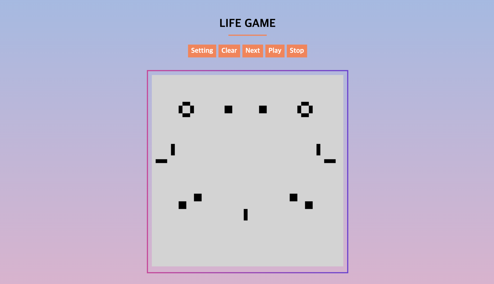

# Lifegame

> 다시 돌아온 웹프로그래밍 수업 이번에는 라이프게임을 제작했다.
> 나는 Canvas를 이용해서 만들어 보았다.

## Features
- 다음 프레임 이동 (자동 재생 / 정지)
- 화면 초기화
- 화면 설정
  - Canvas 크기 변경
  - Cell 크기, Margin 변경
  - 재생 속도 변경

## Programming
- YeJun, Jung (yejun614@naver.com)

## License
- MIT License
